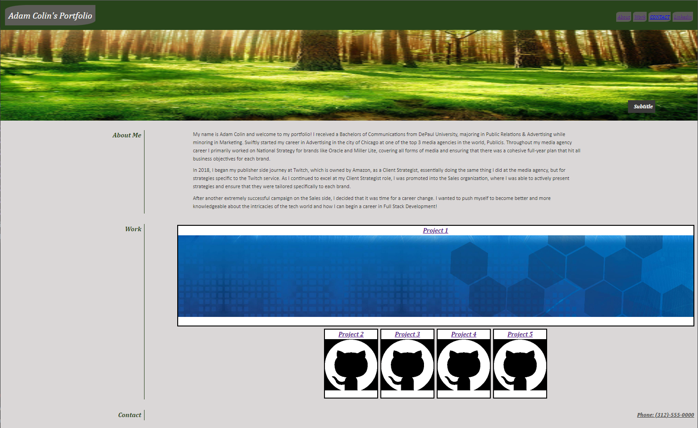

# Challenge 2 - Advanced Portfolio

## Description
- Created a live, webpage portfolio
- Created an About Me section to give some background information about myself for employers
- Created a Work section to showcase everything that I will complete within the NW Coding Bootcamp
- Created external links to my email and my professional Linkedin page

## Screenshot of Portfolio

## Deployed Link
- 